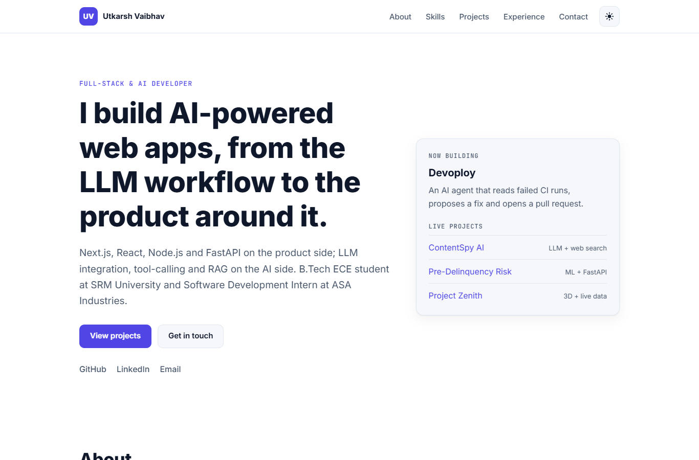

# Portfolio: Utkarsh Vaibhav

**Personal site for Utkarsh Vaibhav, full-stack and AI developer: projects, skills, experience and contact.**

[](https://utkarshportfoliowebsite.vercel.app)


**Live:** https://utkarshportfoliowebsite.vercel.app



## Features

- Sections for about, skills (including AI and agentic AI), projects, experience and contact
- Light and dark themes: follows the system setting, with a toggle that remembers your choice
- Responsive layout with a mobile menu; no horizontal scrolling down to 320 px
- Accessible: skip link, visible focus states, labelled controls, reduced-motion support
- No build step and no framework: plain HTML, CSS and JavaScript; images served as WebP

## Getting started

Open `index.html` in a browser, or serve the folder:

```bash
npx serve .
```

## Project structure

```text
├── index.html
├── css/styles.css         # design tokens, light/dark themes, layout
├── js/main.js             # theme toggle, mobile menu, active link, scroll reveal
├── assets/
│   ├── favicon.svg
│   └── images/projects/   # project screenshots (WebP)
└── docs/screenshots/
```

## Deployment

Deployed on Vercel as a static site from the repository root (no build command).

## License

MIT. See [LICENSE](LICENSE).
